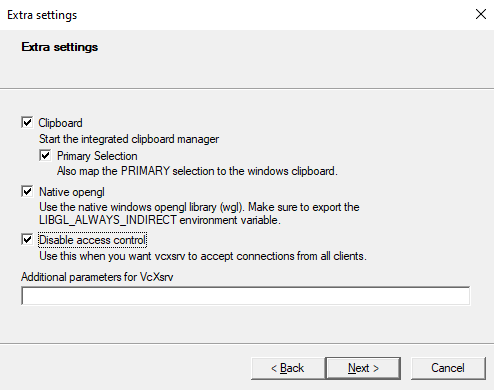
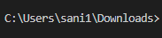

## Nama dan NIM Anggota Kelompok
| Nama | NIM | Github |
| :---: | :---: | :---: |
| Fajar Maulana              | 120140136 | [fajarm19](https://github.com/fajarm19)           |
| Nurul Fikri                | 120140053 | [Fikrii12](https://github.com/Fikrii12)           |
| Edo Sani                   | 120140179 | [saniji](https://github.com/saniji)     |
| Kafindo Ebenov Simbolon    | 120140198 | [KafeSimbolon](https://github.com/KafESimbolon)                 |

## Game Jet War

#### Deskripsi Game Jet War

Jet war merupakan permainan yang dimainkan oleh satu player dengan menggerakkan
pesawat jetnya yang bertujuan untuk menghindari tembakan dari pesawat musuh
yang datang terus menerus dari arah atas maupun dari arah samping. Permainan ini
dimainkan dengan menembak pesawat musuh dan mendapatkan score sebanyak-banyaknya.
Player akan diberikan kesempatan hidup kembali, jika player mati ditempak oleh musuh
atau menabrak jet musuh maka siplayer akan hidup kembali sesuai kesempatan yang
diberikan dan jika kesempatan tersebut sudah habis maka game akan selesai.

## Library yang digunakan untuk Game Jet War

1. Library Pygame, library utama agar game jet war dapat dimainkan.
2. Library Random, digunakan untuk manampilkan lawan/musuh secara random atau acak
3. Abstracmethod, agar dapat menngunakan class abstrak di dalam program game jet war


## Cara Bermain game Jet War

1. Player akan memulai permainan dengan diberikan sebuah jet dan nyawa.
2. Player menembak pesawat musuh dengan menekan tombol 'space' pada keyboard.
3. Setiap musuh yang kalah, player akan mendapatkan score sesuai pesawat musuh yang dihancurkan.
4. Jika player tertembak atau tertabrak oleh pesawat jet musuh, nyawa player akan berkurang 1.
5. Jika player ingin melakukan pause game tekan tombol 'enter' (Lalu jika ingin melanjutkan tekan 'enter' dan 'esc' untuk keluar).
5. Game akan berakhir jika nyawa player sudah habis atau dengan menekan tombol untuk pause yaitu 'enter lalu menekan tombol 'esc' untuk keluar dari game.

## UML Class Diagram


## Menjalankan Pygame Dengan Docker
- Pertama clone repisitory ini atau download dengan cara [KLIK DISINI](https://github.com/saniji/Pygame-dan-Docker/archive/refs/heads/main.zip)
- Setelah itu install vcxsrv yang berfungsi sebagai GUI dalam menjalankan pygame [KLIK DISINI](https://downloads.sourceforge.net/project/vcxsrv/vcxsrv/1.20.14.0/vcxsrv-64.1.20.14.0.installer.exe?ts=gAAAAABikM4htiS-mb2njw45IMlr5iPITdvV6w5QqC2tlvxcF5u9QUvHH742ZgREwNiP9q8K8-TvhIPFacna04QFFrmqVtzk7A%3D%3D&r=https%3A%2F%2Fsourceforge.net%2Fprojects%2Fvcxsrv%2Ffiles%2Flatest%2Fdownload)
- Jalankan Xlaunch dan ceklis seperti gambar dibawah ini, lalu next sampai finish
<div align="center"> 

</div>

- Selanjutnya buka terminal dan masuk ke directory tempat file tersimpan, contohnya seperti ini
<div align="center"> 

</div>

- Sebelum membuat docker container, pastikan docker sudah running dan jalankan syntax berikut pada terminal
```
docker build -t pygame_python .
```
- Setelah container selesai dibuat, kita dapat mengeceknya apakah container tersebut berhasil atau tidak dengan cara
```
docker images
```
- Lalu jalankan container docker dengan perintah berikut
```
docker run --rm -it -e DISPLAY=172.19.192.1:0.0 -v c/users/sani1/downloads/dockerwarjet:/home/user pygame_python /bin/bash
```
- Pada bagian "Display=172.19.192.1" diganti sesuai dengan IPvd Address laptop kalian
- Pada bagian "c/users/sani1/downloads/dockerwarjet" diganti sesuai letak file kalian
- Lalu ketik `ls` untuk melihat file yang ada di dalam container, jika build sukses maka terlihat beberapa file dari program game ini
- Terakhir jalankan syntax berikut untuk memulai game
```
python WarJet.py
```
atau dengan
```
python3 WarJet.py
```

## Video Demo Pygame Dengan Container Docker
